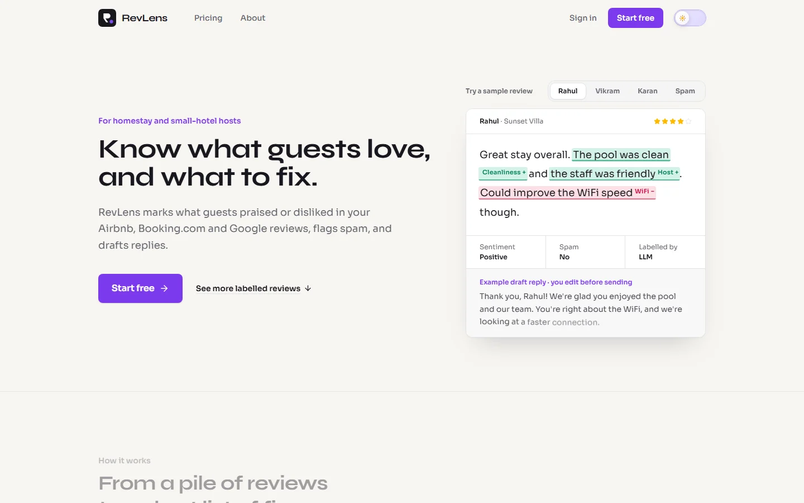
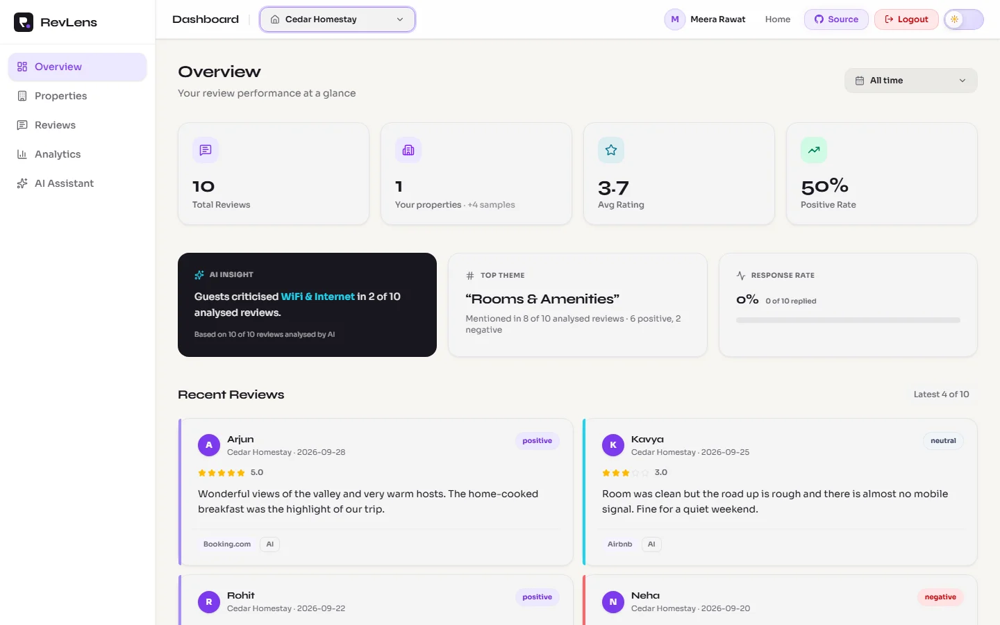
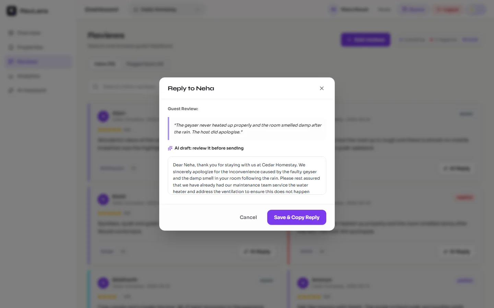
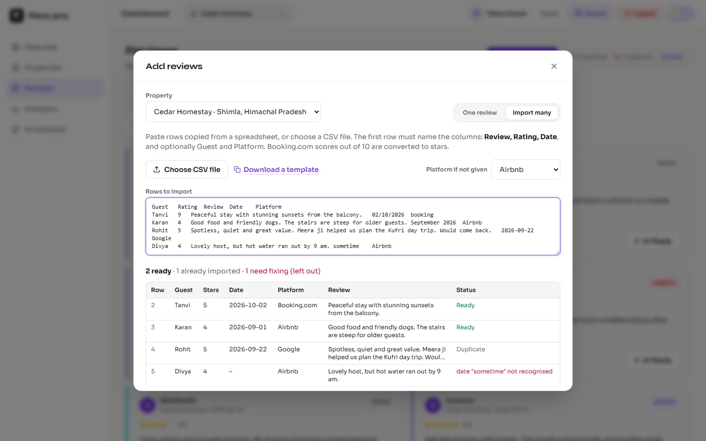
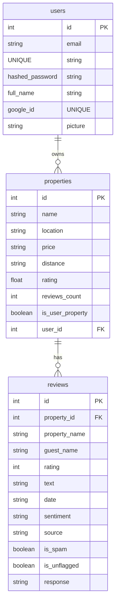

# RevLens AI

> AI-powered review intelligence platform empowering homestay owners to analyze guest reviews, track sentiment, automate responses, and extract actionable business insights.

---

## Live Links & Demo

- **Live Application URL**: [https://revlens.abhinesh.codes](https://revlens.abhinesh.codes)
- **Live Backend API**: [https://revlens-backend.onrender.com/](https://revlens-backend.onrender.com/)
- **Interactive API Documentation (Swagger)**: [https://revlens-backend.onrender.com/docs](https://revlens-backend.onrender.com/docs)
---

## Screenshots

*Sample property and reviews; labels and the reply draft come from the live classifier and Gemini.*


*Figure 1: Landing page with an interactive sample review, labelled by aspect*


*Figure 2: Dashboard: rating, sentiment, the most criticised aspect and recent reviews*


*Figure 3: AI reply draft that addresses the guest's actual complaints, edited by the host before sending*


*Figure 4: Importing reviews from a spreadsheet: per-row preview with duplicates and errors flagged*

---

## Features

- **Guest Review Sentiment Analysis**: Classifies incoming reviews as `positive`, `neutral` or `negative`, using a fine-tuned model when one is deployed, otherwise Google Gemini, otherwise a keyword fallback.
- **Label Provenance**: Every label records who produced it (`model`, `llm`, `heuristic` or `human`) and the UI shows it, so a keyword guess is never presented as AI output.
- **Aspect Themes**: Per-review sentiment for cleanliness, location, WiFi, host, value and amenities, aggregated in Analytics (only reviews the AI actually analysed are counted).
- **Spam & Abuse Detection**: Audits review text for promotional links, repetitive spam patterns, or malicious content.
- **AI-Powered Response Assistant**: Generates warm, professional, on-brand host replies in seconds with customizable tone rules.
- **Property & Review Management (Full CRUD)**: Register homestay properties, add guest reviews, edit existing records, and flag/delete reviews.
- **Analytics & Trend Visualizations**: Real-time breakdown of average ratings, sentiment distributions, and review volume across properties.
- **JWT & OAuth Authentication**: Secure user registration, password hashing with bcrypt, and JWT token protection.
- **Search & Filtering**: Search reviews by guest name, property, or text keywords with real-time dynamic filtering.

---

## Tech Stack

### Frontend
- **Framework**: React 18 (Vite)
- **Styling**: Tailwind CSS
- **Icons & UI Components**: Lucide React
- **State Management & Data Fetching**: React Context API & Axios

### Backend
- **Framework**: FastAPI (Python 3.12)
- **ORM, Migrations & Drivers**: SQLAlchemy, Alembic & psycopg 3
- **Authentication**: PyJWT & Passlib (bcrypt)
- **API Documentation**: OpenAPI / Swagger UI

### Database & AI Services
- **Database**: PostgreSQL hosted on **Supabase**
- **AI Model Integration**: Fine-tuned DeBERTa-v3 classifier served with ONNX Runtime (optional, see [`ml/`](ml/README.md)); Google Gemini API (`gemini-3.5-flash-lite`, configurable via `GEMINI_MODEL`) for reply drafts and classification fallback; keyword heuristics as the last resort

### Hosting & Deployment
- **Frontend Hosting**: Vercel
- **Backend Hosting**: Render (Web Service)
- **CI/CD**: GitHub Actions

---

## Architecture & Folder Structure

```
revlens-ai/
├── backend/                  # FastAPI REST API Backend
│   ├── app/
│   │   ├── ai.py             # Gemini AI integration & fallback prompt logic
│   │   ├── auth.py           # JWT token generation & password hashing
│   │   ├── crud.py           # SQLAlchemy database queries & CRUD operations
│   │   ├── database.py       # Supabase PostgreSQL database engine setup
│   │   ├── main.py           # FastAPI entrypoint, routes, & CORS middleware
│   │   ├── models.py         # SQLAlchemy ORM database models
│   │   └── schemas.py        # Pydantic data validation schemas
│   ├── requirements.txt      # Python backend dependencies
│   └── main.py               # Root app loader
├── frontend/                 # React (Vite) Frontend Application
│   ├── src/
│   │   ├── components/       # Reusable UI components (Navbar, Cards, Modals, Loader)
│   │   ├── context/          # Auth & Property Context Providers
│   │   ├── pages/            # Application routes (Dashboard, Properties, Reviews, Assistant)
│   │   ├── services/         # API client & HTTP request handlers
│   │   ├── App.jsx           # Main React router & layout wrapper
│   │   └── main.jsx          # Vite entrypoint
│   └── package.json          # Frontend dependencies & scripts
├── screenshots/              # Application screenshots used in this README
└── README.md                 # Project documentation
```

### Entity Relationship Diagram (ERD)


```mermaid
erDiagram
    users {
        int id PK
        string email UNIQUE
        string hashed_password
        string full_name
        string google_id UNIQUE
        string picture
    }
    properties {
        int id PK
        string name
        string location
        string price
        string distance
        float rating
        int reviews_count
        boolean is_user_property
        int user_id FK
    }
    reviews {
        int id PK
        int property_id FK
        string property_name
        string guest_name
        int rating
        string text
        string date
        string sentiment
        string source
        boolean is_spam
        boolean is_unflagged
        string response
    }
    users ||--o{ properties : "owns"
    properties ||--o{ reviews : "has"
```

---

## Quick Start & Setup Instructions

### 1. Prerequisites
- Python 3.10+
- Node.js 18+ & npm
- Free Supabase PostgreSQL instance
- Google Gemini API Key ([AI Studio](https://aistudio.google.com/))

### 2. Backend Setup
```bash
# Navigate to backend folder
cd backend

# Create virtual environment
python -m venv venv
source venv/bin/activate  # On Windows: .\venv\Scripts\Activate.ps1

# Install requirements
pip install -r requirements.txt

# Configure environment variables
cp .env.example .env
```

Edit `backend/.env` (all settings are documented in `.env.example`). Use Supabase's **Session pooler** URI:
the direct `db.<ref>.supabase.co` host is IPv6-only. `JWT_SECRET` must be at least 32 characters,
and the app refuses to start without it.

Create the schema, then start the FastAPI backend:
```bash
alembic upgrade head
uvicorn app.main:app --reload --port 8000
```

Run the tests: `pip install -r requirements-dev.txt && pytest tests --ignore=tests/test_api.py`
Backend API will run at `http://localhost:8000`. Access Swagger docs at `http://localhost:8000/docs`.

### 3. Frontend Setup
```bash
# Navigate to frontend folder
cd frontend

# Install dependencies
npm install

# Start development server
npm run dev
```
Frontend will load at `http://localhost:5173`.

---

## API Endpoints Documentation

| Method | Endpoint | Description | Auth Required |
| :--- | :--- | :--- | :--- |
| `POST` | `/api/auth/register` | Register a new homestay host account | No |
| `POST` | `/api/auth/login` | Obtain JWT access token via email & password | No |
| `POST` | `/api/auth/google` | Authenticate via Google OAuth ID token | No |
| `GET` | `/api/auth/me` | Fetch authenticated host profile | Yes |
| `GET` | `/api/properties` | Fetch registered properties | Yes |
| `POST` | `/api/properties` | Create a new property | Yes |
| `GET` | `/api/reviews` | List guest reviews (filterable by property & sentiment) | Yes |
| `GET` | `/api/reviews/search` | Search review text, guest names, or properties | Yes |
| `POST` | `/api/reviews` | Submit a new guest review | Yes |
| `POST` | `/api/reviews/{id}/generate-reply` | Generate a host reply draft (`source`: `llm` or `template`) | Yes |
| `POST` | `/api/ai/analyze-review` | Classify arbitrary text and draft a reply, reporting which model answered | Yes |
| `POST` | `/api/ai/ask` | AI Assistant: answers a question from your own reviews only, citing the review ids used | Yes |
| `GET` | `/api/ai/status` | Which engine is answering now (`model` / `llm` / `heuristic`), for the fallback notice | Yes |
| `PUT` | `/api/reviews/{id}` | Update review content | Yes |
| `PATCH` | `/api/reviews/{id}/flag` | Flag or unflag review as spam | Yes |
| `DELETE` | `/api/reviews/{id}` | Delete a review | Yes |
| `GET` | `/api/reviews/sentiment-summary` | Aggregated positive/neutral/negative counts | Yes |
| `GET`/`HEAD` | `/health` | Health check for uptime monitors | No |

---

## Known Limitations & Deployment Notes

- **Render Free Tier Cold Start**: The backend hosted on Render's free web service spins down after 15 minutes of inactivity. Initial requests after idle may take 30–50 seconds to wake up the server.
- **Gemini API Quota**: The free tier is rate-limited. When Gemini is unavailable, RevLens falls back to keyword rules and template replies, and labels them as such (`heuristic` / `template`) instead of presenting them as AI output.
- **Model evaluation**: The fine-tuned classifier (0.80 sentiment macro-F1 on a 40k-review held-out test set; scores, error analysis and limits in [`ml/RESULTS.md`](ml/RESULTS.md)) is trained and measured on public TripAdvisor hotel reviews (academic use only, see [`ml/DATASETS.md`](ml/DATASETS.md)); expect some domain shift on Indian homestay reviews.

---

## Credits & Acknowledgements

- **Google Gemini API** for generative text capabilities and review sentiment modeling.
- **Supabase** for managed PostgreSQL cloud hosting.
